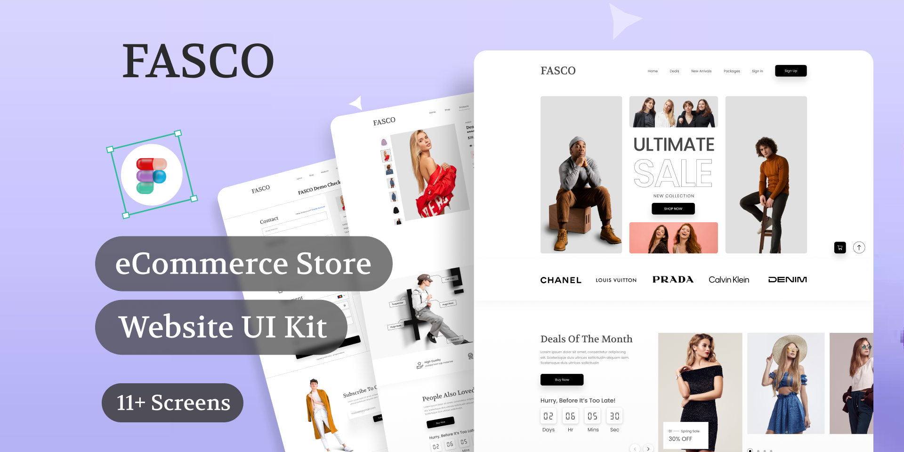

# FASCO E-commerce Platform



Modern e-commerce storefront built with React 19, TypeScript, and Feature-Sliced Design (FSD) architecture.

The project demonstrates scalable frontend architecture, predictable state management with Redux Toolkit, and safe data validation using Zod schemas.

[🚀 Live Preview Link](https://fasco-shop-fsd.vercel.app/) | [🎨 Design Reference (Figma)](https://www.figma.com/design/dM9Uuam4Qyxm70eHZzHPwE/Online-Shopping-Website-Design---eCommerce-Store-Website---UI-Kit--Community-?node-id=114-231&t=CKebb5B5ZkBcr9st-0)

---

## 🔑 Demo Access

To access the full functionality of the application, you need to register or log in.

Authentication in this project is **demo-only** and does not connect to a real backend.

You can register with any email and password that match the validation rules below.

### Email

Must be a valid email format.

Example:

example@email.com

### Password requirements

The password must:

- contain **8–64 characters**
- include **at least one uppercase letter**
- include **at least one number**
- include **one special character**

Allowed special characters:

! @ # $ % ^ & \*

---

## 🚀 Tech Stack

- **Framework**: React 19 + Vite
- **Language**: TypeScript (Strict Mode)
- **State Management**: Redux Toolkit (RTK)
- **Architecture**: Feature-Sliced Design (FSD)
- **Validation**: Zod (Runtime Schema Validation)
- **Styling**: Tailwind CSS v4
- **Forms**: React Hook Form + Zod Resolvers
- **API**: FakeStoreAPI / Axios

---

## ✨ Features

- Product catalog
- Product search with debounce
- Sorting by price
- Wishlist management
- Shopping cart state
- Responsive UI
- Form validation with Zod
- Modular frontend architecture (FSD)

---

## 🛠️ Architecture Highlights (FSD)

This project strictly follows the Feature-Sliced Design methodology to ensure high maintainability:

- **App**: Global providers, styles, and initialization.
- **Pages**: Composition of widgets into full-scale routes.
- **Widgets**: Complex, self-contained UI blocks (e.g., ProductGrid, Navbar).
- **Features**: User actions (e.g., AddToCart, FilterProducts).
- **Entities**: Business logic and data models (Product, User, Cart).
- **Shared**: Reusable UI components, API clients, and utility functions.

---

## 📂 Project Structure

src
├─ app
├─ pages
├─ widgets
├─ features
├─ entities
└─ shared

---

## 🛡️ Data Safety

- External API responses are validated using Zod schemas before entering application state.
- This prevents invalid or unexpected data from corrupting Redux state.

---

## ⚙️ Installation

Clone the repository:

```bash
git clone https://github.com/your-username/fasco-shop

Install dependencies:

npm install

Start development server:

npm run dev
```

---

## 📈 Roadmap

[x] Project setup
[x] FSD architecture
[x] Product catalog
[x] Wishlist
[x] Cart logic
[x] Pagination
[x] Checkout flow
[x] Product filters
